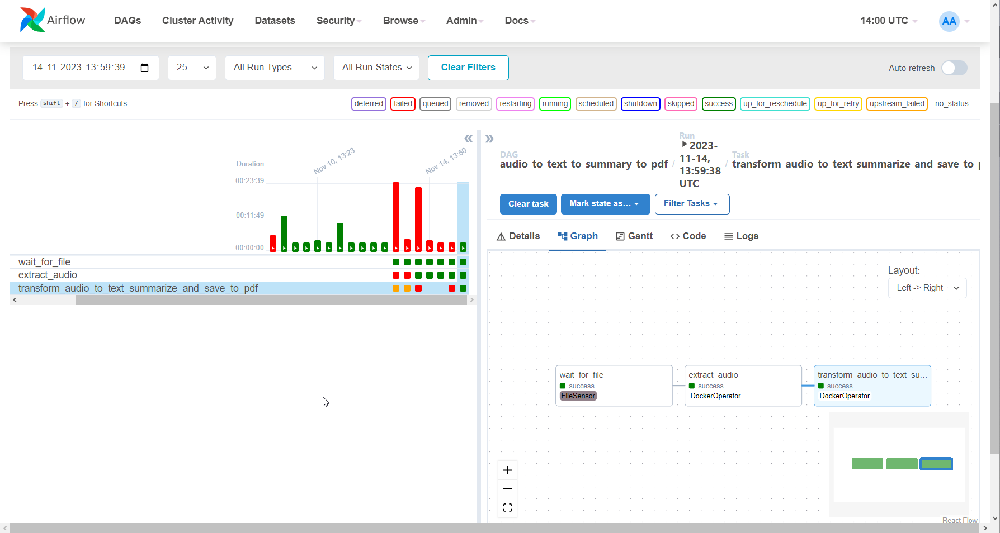
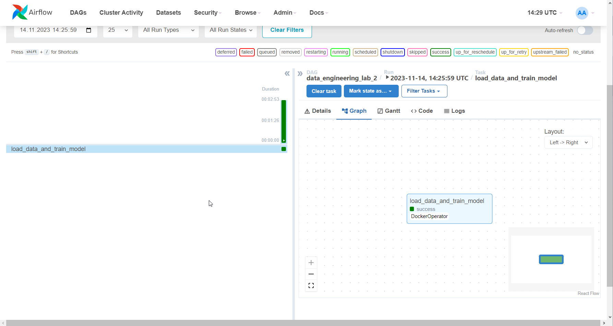

# Отчет по лабораторной работе №2

При построении первого пайплайна главной проблемой было запустить и настроить контейнеризацию докер в докере, после того как это было успешно выполнено задача построения пайплайна довольно просто решалась.

В качестве пояснения к получившемуся пайплайну отмечаю, что для задачи был создан докер [образ](./Dockerfile) и размещен на докер хаб https://hub.docker.com/repository/docker/ermkeg/lab2/general для возможности доступа из среды Airflow. Так как в изначальном коде предлагаемой архитектуры пайплайна предполагались к использованию отдельные контейнеры для каджого этапа, но создавал я только один, в целях экономии времени на загрузку и развертываение контейнера, операции выполняющиеся в виде питон файла были объединены, так пайплайн получился чуть короче.



Конвертация видео в аудио была выполненена с помощью предлагаемой утилиты ffmpeg, трансформация аудио в тектс выполнялась через упакованную в отдельный питон package сети whisper, а суммаризация полученного текста с помощью модели Bart в виде имплементации пайплайна в transfromers. Итоговый экспорт полученного файла в пдф был сделан с помощью fpdf.

Для второго пайплайна была обучена тестовая модель выполняющая классификацию на датасете MNIST, опять же элементы пайплайна котороые молги быть выполнены в одном файле были объединены, и выполнялись в контейнере [tensorflow](https://hub.docker.com/r/tensorflow/tensorflow/)

Итоговый пайплайн представлен на рисунке:



А получившаяся модель экспортирована в формате tensorflow [модели](./saved_model.pb). Так же во время обучения происходила запись [логов](./log.csv) с каждой эпохи.

# Лабораторная работа №2

## Инференс и обучение НС

В рамках данной лабораторной работы предлагается построить два пайплайна:

1. Пайплайн, который позволяет получить предсказания для исходных данных с помощью некоторой модели.
2. Пайплайн, который позволяет обучить или дообучить целевую модель.

Для построения такого пайплайна воспользуемся следующими инструментами:

- Apache Airflow

## Подготовка к выполнению задания

Для выполнения лабораторной работы рекомендуется использовать докер контейнеры из подготовительного репозитория: https://github.com/ssau-data-engineering/Prerequisites/tree/main

## Задание на лабораторную работу

### Пайплайн для инференса данных

В рамках данного задания предлагается построить пайплайн, который реализует систему "Автоматического распознавания речи" для видеофайлов.

Построенный пайплайн будет выполнять следующие действия поочередно:

1. Производить мониторинг целевой папки на предмет появления новых видеофайлов.
2. Извлекать аудиодорожку из исходного видеофайла.
3. Преобразовывать аудиодорожку в текст с помощью нейросетевой модели.
4. Формировать конспект на основе полученного текста.
5. Формировать выходной .pdf файл с конспектом.

### Пайплайн для обучения модели

В рамках данного задания предлагается построить пайплайн, который реализует систему автоматического обучения/дообучения нейросетевой модели.

Предлагается самостоятельно выбрать набор данных и модель для обучения. Например, можно реализовать пайплайн для обучения модели, которую вы планируете использовать в вашей НИР или ВКРМ. Это также позволит вам добавить отдельный пункт в ваш отчет.

Итак, пайплайн будет выполнять следующие действия:

1. Читать набор файлов из определенного источника (файловой системы, сетевого интерфейса и т.д.).
2. Формировать пакет данных для обучения модели.
3. Обучать модель.
4. Сохранять данные результатов обученя (логи, значения функции ошибки) в текстовый файл

Для успешного выполнения задания необходимо продемонстрировать успешность обучения модели и приложить файл .ipynb, в котором продемонстрирован процесс инференса данной модели.

## Сдача лабораторной работы

Для успешной сдачи лабораторной работы ваш репозиторий должен содержать следующее:

1. Отчет, описывающий этапы выполнения работы (скриншоты, описание встреченных проблем и их решения приветствуются) в формате .pdf или .md.
2. Программный код, реализующий пайплайны.
3. Открыт Pull Request в данный репозиторий.

## Шаблоны решений

Шаблоны далее отображают **возможную** конфигурацию пайплайнов с использованием `DockerOperator`

### Пайплайн для инференса


```python
from datetime import datetime
from airflow import DAG
from airflow.providers.docker.operators.docker import DockerOperator
from airflow.sensors.filesystem import FileSensor

default_args = {
    'owner': 'airflow',
    'start_date': datetime(2023, 1, 1),
    'retries': 1,
}

dag = DAG(
    'audio_to_text_to_summary_to_pdf',
    default_args=default_args,
    description='DAG for extracting audio, transforming to text, summarizing, and saving as PDF',
    schedule_interval=None,
)

wait_for_new_file = FileSensor(
    task_id='wait_for_new_file',
    poke_interval=10,  # Interval to check for new files (in seconds)
    filepath='/path/to/input_video',  # Target folder to monitor
    fs_conn_id='<file-connection-id>', # Check FAQ for info
    dag=dag,
)

extract_audio = DockerOperator(
    task_id='extract_audio',
    image='ffmpeg_image',
    command='ffmpeg -i input_video.mp4 -vn audio.wav',
    mounts=[Mount(source='/data', target='/data', type='bind')],
    docker_url="tcp://docker-proxy:2375",
    dag=dag,
)

transform_audio_to_text = DockerOperator(
    task_id='transform_audio_to_text',
    image='ml_model_image',
    command='python audio_to_text.py --input audio.wav --output text.txt',
    mounts=[Mount(source='/data', target='/data', type='bind')],
    docker_url="tcp://docker-proxy:2375",
    dag=dag,
)

summarize_text = DockerOperator(
    task_id='summarize_text',
    image='ml_model_image',
    command='python summarize_text.py --input text.txt --output summary.txt',
    mounts=[Mount(source='/data', target='/data', type='bind')],
    docker_url="tcp://docker-proxy:2375",
    dag=dag,
)

save_to_pdf = DockerOperator(
    task_id='save_to_pdf',
    image='ml_model_image',
    command='python save_to_pdf.py --input summary.txt --output result.pdf',
    mounts=[Mount(source='/data', target='/data', type='bind')],
    docker_url="tcp://docker-proxy:2375",
    dag=dag,
)

wait_for_new_file >> extract_audio >> transform_audio_to_text >> summarize_text >> save_to_pdf
```

### Пайплайн для обучения НС

```python
from datetime import datetime
from airflow import DAG
from airflow.providers.docker.operators.docker import DockerOperator

default_args = {
    'owner': 'airflow',
    'start_date': datetime(2023, 1, 1),
    'retries': 1,
}

dag = DAG(
    'data_engineering_lab_2',
    default_args=default_args,
    description='DAG for data engineering lab 2: training a neural network',
    schedule_interval=None,
)

read_data = DockerOperator(
    task_id='read_data',
    image='read_data_image',
    command='python read_data.py --input /data --output /prepared_data',
    mounts=[Mount(source='/data', target='/data', type='bind')],
    docker_url="tcp://docker-proxy:2375",
    dag=dag,
)

train_model = DockerOperator(
    task_id='train_model',
    image='train_model_image',
    command='python train_model.py --input /prepared_data --output /trained_model',
    mounts=[Mount(source='/data', target='/data', type='bind')],
    docker_url="tcp://docker-proxy:2375",
    dag=dag,
)

read_data >> train_model

```

## FAQ

- В рамках работы рекомендуется использовать именно `DockerOperator` по следующему ряду причин:
    1. **Портативность и независимость от окружения**: Docker позволяет упаковать все зависимости, включая версии программного обеспечения, библиотеки и конфигурацию, в контейнер. Это гарантирует, что ваша задача будет выполняться в одинаковом окружении, независимо от того, где она запускается.
    2. **Изоляция**: Каждая задача выполняется в собственном контейнере, что обеспечивает изоляцию ресурсов и предотвращает взаимное влияние между задачами. Это особенно полезно, когда задачи требуют разных версий программного обеспечения или библиотек.
    3. **Масштабируемость**: Docker позволяет запускать и масштабировать задачи параллельно, а также легко управлять пакетами данных и моделями. Это особенно полезно при обработке больших объемов данных или при обучении моделей на кластере.
    4. **Управление зависимостями**: Docker позволяет легко управлять зависимостями и версиями программного обеспечения. Вы можете создать образ контейнера, содержащий все необходимые зависимости, и использовать его для запуска задачи без необходимости установки и настройки всех зависимостей на целевой системе.

- Для работы с видеозаписями, в нашем случае для эксопрта аудиодорожки в отдельный файл рекомендуется использовать
утилиту `ffmpeg`

- Для преобразования аудиозаписи в текст вы можете использовать следующую модель: <https://huggingface.co/openai/whisper-small>
  Данная модель способна преобразовывать в речь с различных языков, в том числе и русского.
  *Однако вы не ограничены в применении лишь этой модели.*

- Для составления конспекта по тексту вы можете использовать следующую модель: <https://huggingface.co/slauw87/bart_summarisation>
  К сожалению **небольших** моделей способных к анализу русского крайне мало и работают они крайне не эффективно. 
  Поэтому в рамках лабораторной работы предлагается анализировать **англоязычную** речь.
  *Однако если ваше вычислительное устройство или кластер позволяют запустить большую мультимодальную языковую модель (LLM), вы можете попробовать составлять конспекты и для русскоязычных текстов.*

- Для реализации `DockerOperator` для работы с моделями трансформеров вы можете использовать множество разных подходов:
  1. Использовать API HuggingFace
        ```python
        import requests
        API_URL = "https://api-inference.huggingface.co/models/openai/whisper-small"
        headers = {"Authorization": f"Bearer {API_TOKEN}"}

        def query(filename):
            with open(filename, "rb") as f:
                data = f.read()
            response = requests.post(API_URL, headers=headers, data=data)
            return response.json()

        output = query("sample1.flac")
        ```
    2. **(Наиболее предпочтительный способ)** 
    Использовать библиотеку [`transformers`](https://github.com/huggingface/transformers) и собрать собственный образ
    3. Найти готовый образ, например <https://hub.docker.com/r/onerahmet/openai-whisper-asr-webservice>

- Для реализации `FileSensor` оператора необходимо создать `Connection` средствами веб-интерфейса Airflow. За подробной инструкцией
можно обратиться к докумментации: <https://airflow.apache.org/docs/apache-airflow/stable/howto/connection.html#creating-a-connection-with-the-ui>

- В силу использования `dind` (docker-in-docker) для реализации пайплайна с использованием `DockerOperator` 
возникает ряд особенностей связанных с контейнеризацией. Рассмотрим далее лишь особенность связанную с работой с файлами и опустим
проблемы возникающие с организацией `dind` в целом. 

(если вопрос организации `dind` инфраструктуры вам интересен, то можете обратиться по следующим ссылкам: [[1]](https://shisho.dev/blog/posts/docker-in-docker/), [[2]](https://github.com/ssau-data-engineering/Lab-2/issues/1))

Итак, в рамках лабораторных работ предлагается использовать инфраструктуру заданную конфигурационными файлами `docker-compose` 
в репозитории **Prerequisites**. В конфигурации относящейся непосредственно к сервисам Apache Airflow можно заметить контейнер
**docker-proxy**, который и позволит нам пользоваться `DockerOperator` в наиболее безопасной манере. 
```yaml
  docker-proxy:
    image: docker:24-dind
    privileged: true
    environment:
      DOCKER_TLS_CERTDIR: ""
    volumes:
      - ./airflow/data:/data
```
Обратите внимание на то,
какая директория проброшена для данного контейнера: `./airflow/data:/data`. 
Это означает что **docker-proxy**, который ответственнен
за процесс менеджмента контейнеров `DockerOperator`, имеет доступ к данным 
находящимся внутри `./airflow/data`, что в свою очередь для нас означает возможность использования файлов из
директории `/Prerequisits/airflow/data` внутри **docker-proxy** по пути `/data`. Если обратиться к шаблону возможной реализации
пайплайна - вы можете наблюдать, что для контейнеров `DockerOperator` происходит отображение директории `/data:/data`,
соответственно конейнеры для получения доступа к данным должны использовать именно директорию `/data`.
